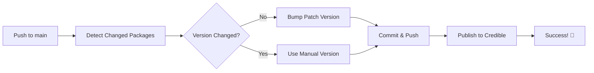

# CI/CD Template: Credible Automated Package Versioning and Publishing

[](https://github.com)
[](https://github.com)

> 🚀 **Production-ready CI/CD template** for automated package versioning and publishing to Credible platform with enterprise-grade security and robustness.

## 🎯 Overview

This CI/CD pipeline automatically:
1. ✅ Detects changes to packages in your repository
2. ✅ Bumps package versions following semantic versioning (with prerelease/build metadata support)
3. ✅ Commits version changes back to your repository
4. ✅ Publishes packages to the Credible platform
5. 🔒 Secured against command injection, path traversal, and secret exposure
6. 🛡️ Handles race conditions with exponential backoff retry logic

## ✨ Key Features

### Security & Robustness
- 🔒 Input validation and sanitization (prevents command injection)
- 🛡️ Path traversal protection
- 🔐 Secret masking in logs
- 🔄 Git push retry with exponential backoff (handles concurrent merges)
- ✅ Graceful error handling (one bad package doesn't break the entire workflow)

### Semantic Versioning Support
- 📦 Full semver support: `1.0.0-alpha.1` → `1.0.1-alpha.1` (preserves metadata)
- 🏷️ Prerelease versions: `-alpha`, `-beta`, `-rc`
- 🔨 Build metadata: `+build.123`
- 🎯 Smart detection: Only bumps when code changes (not name/description)

### Developer Experience
- 🚫 Handles spaces in package names and paths
- 📝 Detailed error messages and summaries
- 🔍 Transparent logging
- 🎨 Clean GitHub Actions summaries

## 📋 Prerequisites

Before using this template, ensure you have:
- A GitHub repository (or use "Use this template" button)
- Admin access to the repository
- Access to your Credible organization and project
- Packages organized under a `packages/` directory

## 📖 Table of Contents

1. [Quick Start](#quick-start)
2. [Repository Structure](#1-repository-structure)
3. [Required Scripts Setup](#2-required-scripts-setup)
4. [GitHub App Configuration](#3-github-app-configuration)
5. [Repository Secrets and Variables](#4-repository-secrets-and-variables)
6. [Branch Protection Rules](#5-branch-protection-rules)
7. [Workflow Files Setup](#6-workflow-files-setup)
8. [Security Features](#8-security-features)
9. [Advanced Configuration](#9-advanced-configuration)
10. [Troubleshooting](#7-troubleshooting)

---

## Quick Start

### Using This Template

1. **Click "Use this template"** button on GitHub (or clone this repository)
2. **Set up GitHub App** for bot authentication (see [Section 3](#3-github-app-configuration))
3. **Configure secrets and variables** (see [Section 4](#4-repository-secrets-and-variables))
4. **Create your packages** under `packages/` directory
5. **Push changes** and watch the magic happen! ✨

### What Happens on Push?



---

## 1. Repository Structure

Your repository should follow this structure:

```
your-repo/
├── .github/
│   └── workflows/
│       ├── deploy.yml
│       ├── bump-package-versions.yml
│       └── publish-packages.yml
├── packages/
│   ├── package-one/
│   │   ├── publisher.json
│   │   └── [your package files]
│   ├── package-two/
│   │   ├── publisher.json
│   │   └── [your package files]
│   └── ...
└── scripts/
    ├── detect_changed_packages.py
    ├── bump_versions.py
    └── cred_publish.sh
```

### Package Structure

Each package must have a `publisher.json` file with this minimum structure:

```json
{
  "name": "your-package-name",
  "version": "0.0.0",
  "description": "Package description"
}
```

---

## 2. Required Scripts Setup

Create a `scripts/` directory in your repository root and add the following three scripts:

### Script 1: `detect_changed_packages.py`

Create `scripts/detect_changed_packages.py` and make it executable:

```bash
chmod +x scripts/detect_changed_packages.py
```

Copy the content from the provided `detect_changed_packages.py` file. This script:
- Detects which packages have changed between commits
- Identifies packages that already had their version bumped
- Outputs lists of packages that need bumping vs. already bumped

### Script 2: `bump_versions.py`

Create `scripts/bump_versions.py` and make it executable:

```bash
chmod +x scripts/bump_versions.py
```

Copy the content from the provided `bump_versions.py` file. This script:
- ✅ Automatically increments the patch version of packages
- ✅ Updates the `publisher.json` file
- ✅ Handles full semantic versioning with prerelease/build metadata
- ✅ **Security:** Validates package names and versions (prevents command injection)
- ✅ **Robustness:** Continues processing even if one package fails

**Examples:**
- `1.0.0` → `1.0.1`
- `1.0.0-alpha.1` → `1.0.1-alpha.1` (preserves prerelease)
- `1.0.0+build.123` → `1.0.1+build.123` (preserves build metadata)

### Script 3: `cred_publish.sh`

Create `scripts/cred_publish.sh` and make it executable:

```bash
chmod +x scripts/cred_publish.sh
```

Copy the content from the provided `cred_publish.sh` file. This script:
- Installs and configures the Credible CLI
- Publishes packages to the Credible platform
- Handles retries and error reporting
- Provides detailed publish summaries

---

## 3. GitHub App Configuration

To allow the CI/CD bot to commit version bumps back to your repository, you need to create a GitHub App.

### Step 1: Create a GitHub App

1. Go to your GitHub organization settings
2. Navigate to **Settings** > **Developer settings** > **GitHub Apps** > **New GitHub App**
3. Fill in the following:
   - **GitHub App name**: `credible-cicd-bot` (or your preferred name)
   - **Homepage URL**: Your organization URL
   - **Webhook**: Uncheck "Active"
   
4. Set **Repository permissions**:
   - **Contents**: Read and write
   - **Pull requests**: Read and write
   - **Metadata**: Read-only

5. Set **Where can this GitHub App be installed?**: "Only on this account"

6. Click **Create GitHub App**

### Step 2: Generate Private Key

1. After creating the app, scroll down to **Private keys**
2. Click **Generate a private key**
3. Save the downloaded `.pem` file securely

### Step 3: Install the App

1. Go to **Install App** in the left sidebar
2. Click **Install** next to your organization
3. Select **Only select repositories** and choose your repository
4. Click **Install**

### Step 4: Note the App ID

1. Go back to your app's settings
2. Note the **App ID** at the top of the page

---

## 4. Repository Secrets and Variables

### Add Repository Secrets

Navigate to your repository: **Settings** > **Secrets and variables** > **Actions** > **New repository secret**

Add the following secrets:

1. **`CICD_BOT_APP_ID`**
   - Value: The App ID from Step 3.4

2. **`CICD_BOT_APP_PRIVATE_KEY`**
   - Value: The entire contents of the `.pem` file (including the BEGIN/END lines)

3. **`JWT_ACCESS_TOKEN`**
   - Value: Your Credible platform JWT access token
   - To obtain this: Log into your Credible account and generate an API token from your account settings

### Add Repository Variables

Navigate to your repository: **Settings** > **Secrets and variables** > **Actions** > **Variables** > **New repository variable**

Add the following variables:

1. **`CRED_ORG`**
   - Value: Your Credible organization name

2. **`CRED_PROJECT`**
   - Value: Your Credible project name

3. **`SET_LATEST`** (optional)
   - Value: `true` or `false`
   - Default: `true` (publishes with `--set-latest` flag)
   - Set to `false` if you don't want to mark published versions as latest

---

## 5. Branch Protection Rules

Configure branch protection for your `main` branch to work with the CI/CD bot.

### Step 1: Enable Branch Protection

1. Go to **Settings** > **Branches**
2. Click **Add branch protection rule**
3. In **Branch name pattern**, enter: `main`

### Step 2: Configure Protection Settings

Enable the following settings based on the screenshots provided:

#### Pull Request Settings
- ✅ **Allow merge commits**
- ✅ **Allow rebase merging**

#### Bypass Settings
- ✅ **Allow specified actors to bypass required pull requests**
  - Add: `credible-cicd-bot` (or your bot name)
  - This allows the bot to push version bump commits directly

#### Status Checks
- ✅ **Require status checks to pass before merging**
- ✅ **Require branches to be up to date before merging**

#### Push Restrictions
- ✅ **Restrict who can push to matching branches**
  - Add: `credible-cicd-bot` (or your bot name)
- ✅ **Restrict pushes that create matching branches**
  - Add: `credible-cicd-bot` (or your bot name)

### Step 3: Save Changes

Click **Create** or **Save changes** to apply the branch protection rules.

---

## 6. Workflow Files Setup

Create three workflow files in `.github/workflows/`:

### Workflow 1: `deploy.yml` (Main Orchestrator)

Create `.github/workflows/deploy.yml`:

```yaml
name: Bump and Publish Packages

on:
  push:
    branches: [main]
    paths:
      - 'packages/**'

permissions:
  contents: write
  pull-requests: write
  id-token: write

concurrency:
  group: ${{ github.workflow }}-${{ github.ref }}
  cancel-in-progress: false

jobs:
  bump:
    if: github.event.head_commit.author.name != 'credible-bot[bot]' && !contains(github.event.head_commit.message, 'auto-bump')
    uses: ./.github/workflows/bump-package-versions.yml
    secrets:
      app_id: ${{ secrets.CICD_BOT_APP_ID }}
      private_key: ${{ secrets.CICD_BOT_APP_PRIVATE_KEY }}

  publish:
    needs: bump
    if: needs.bump.outputs.bumped != ''
    uses: ./.github/workflows/publish-packages.yml
    with:
      packages: ${{ needs.bump.outputs.bumped }}
      set_latest: ${{ vars.SET_LATEST == 'false' && false || true }}
      cred_org: ${{ vars.CRED_ORG }}
      cred_project: ${{ vars.CRED_PROJECT }}
    secrets:
      jwt_access_token: ${{ secrets.JWT_ACCESS_TOKEN }}
```

### Workflow 2: `bump-package-versions.yml`

Copy the entire content from the provided `bump-package-versions.yml` file.

### Workflow 3: `publish-packages.yml`

```yaml
name: Publish Packages

on:
  workflow_call:
    inputs:
      packages:
        description: "Space-separated list of packages to publish (format: path|name|version)"
        required: true
        type: string
      set_latest:
        description: "Whether to set as latest version"
        required: false
        type: boolean
        default: true
      cred_org:
        description: "Organization name"
        required: true
        type: string
      cred_project:
        description: "Project name"
        required: true
        type: string
    secrets:
      jwt_access_token:
        required: true

permissions:
  contents: read
  id-token: write

jobs:
  publish:
    runs-on: ubuntu-latest

    steps:
      - uses: actions/checkout@v4
        with:
          fetch-depth: 0
          ref: ${{ github.ref }}
      
      - name: Pull latest changes from bump job
        run: |
          git fetch origin ${{ github.ref_name }}
          git checkout ${{ github.ref_name }}
          git pull origin ${{ github.ref_name }}

      - name: Install dependencies
        run: |
          sudo apt-get update -y
          sudo apt-get install -y jq
          npm install -g @credibledata/cred-cli

      - name: Publish packages
        id: publish
        shell: bash
        env:
          ACCESS_TOKEN: ${{ secrets.jwt_access_token }}
          ORGANIZATION_NAME: ${{ inputs.cred_org }}
          PROJECT_NAME: ${{ inputs.cred_project }}
          SET_LATEST: ${{ inputs.set_latest }}
          PACKAGES: ${{ inputs.packages }}
        run: |
          set -Eeuo pipefail
          chmod +x scripts/cred_publish.sh

          # Remove whitespace from packages input
          PACKAGES=$(echo "$PACKAGES" | sed 's/ //g')

          # Validate packages input
          if [ -z "$PACKAGES" ]; then
            echo "No packages to publish"
            exit 0
          fi
          
          # Build command
          if [ "$SET_LATEST" = "true" ]; then
            SET_LATEST_FLAG="-L"
          else
            SET_LATEST_FLAG=""
          fi
          
          # Call script (handles all logic: retry, error handling, summary)
          scripts/cred_publish.sh \
            -o "$ORGANIZATION_NAME" \
            -P "$PROJECT_NAME" \
            -a "$ACCESS_TOKEN" \
            -p "$PACKAGES" \
            $SET_LATEST_FLAG
```

---

## 8. Security Features

This template includes enterprise-grade security measures:

### 🔒 Input Validation & Sanitization

**Package Name Validation:**
- ✅ Only allows: `a-z A-Z 0-9 space - _ .`
- ✅ Maximum length: 255 characters
- ❌ Rejects shell metacharacters: `; | & $ ( ) < > \` etc.
- 🛡️ **Prevents:** Command injection attacks

**Version Validation:**
- ✅ Validates semver format
- ✅ Maximum version part: 999999
- 🛡️ **Prevents:** Integer overflow, malformed versions

**Path Validation:**
- ✅ Ensures all paths are within `packages/` directory
- ✅ Resolves symlinks and `..` references
- 🛡️ **Prevents:** Path traversal attacks (e.g., `../../etc/passwd`)

### 🔐 Secret Protection

**Secret Masking:**
- ✅ Suppresses `JWT_ACCESS_TOKEN` output in logs
- ✅ Masks sensitive `cred` CLI commands
- ✅ Error messages don't leak credentials
- 🛡️ **Prevents:** Accidental secret exposure in GitHub Actions logs

### 🛡️ Robustness Features

**Git Push Retry Logic:**
- ✅ Maximum 5 retries with exponential backoff (2s, 4s, 8s, 16s, 32s)
- ✅ Handles rebase conflicts automatically
- ✅ Aborts and retries on conflict detection
- 🛡️ **Handles:** Concurrent merges, race conditions

**Error Handling:**
- ✅ Graceful degradation (one bad package doesn't break workflow)
- ✅ Specific exception catching with helpful messages
- ✅ File size validation (max 1MB for publisher.json)
- 🛡️ **Prevents:** OOM errors, workflow failures

**Bot Loop Prevention:**
- ✅ Checks both bot name AND email
- ✅ Multiple commit message checks (`[skip ci]`, `auto-bump`)
- 🛡️ **Prevents:** Infinite loop if bot name is spoofed

### 📝 Security Best Practices

**When Using This Template:**

1. ✅ **Never commit secrets** - Use GitHub Secrets only
2. ✅ **Rotate tokens regularly** - Update `JWT_ACCESS_TOKEN` periodically
3. ✅ **Review bot permissions** - Minimize GitHub App permissions
4. ✅ **Monitor workflow logs** - Check for suspicious activity
5. ✅ **Use branch protection** - Prevent direct pushes to main

**Add to `.gitignore`:**
```gitignore
# Never commit these
.env
.env.*
*.pem
*.key
secrets/
credentials/
```

---

## 9. Advanced Configuration

### Package Naming Best Practices

**✅ Recommended:**
- `my-package` (hyphens)
- `my_package` (underscores)
- `mypackage` (no spaces)

**⚠️ Works but not recommended:**
- `my package` (spaces - harder to handle in CLI)
- `My.Package` (dots - can be confused with versions)

**❌ Not allowed (will be rejected):**
- `my;package` (semicolon - shell metacharacter)
- `my|package` (pipe - breaks delimiter)
- `my$package` (dollar - shell variable)

### Version Strategies

**Automatic Patch Bumping (Default):**
```json
{
  "version": "1.0.0"
}
```
→ On file change: `1.0.0` → `1.0.1`

**Manual Version Control:**
```json
{
  "version": "2.0.0"  // Manually set major/minor
}
```
→ Workflow detects manual change and skips auto-bump → Publishes `2.0.0`

**Prerelease Versions:**
```json
{
  "version": "1.0.0-beta.1"
}
```
→ On file change: `1.0.0-beta.1` → `1.0.1-beta.1` (preserves prerelease tag)

**Build Metadata:**
```json
{
  "version": "1.0.0+build.123"
}
```
→ On file change: `1.0.0+build.123` → `1.0.1+build.123` (preserves build)

### Handling Edge Cases

**Deleted Files:**
- ✅ Deletion of files inside a package **triggers version bump**
- ✅ Deletion of entire package (including publisher.json) **is silently ignored**
- ✅ No errors, workflow continues

**Space in Names:**
- ✅ Package directory: `packages/my package/` - Supported
- ✅ Package name: `"my package"` in publisher.json - Supported
- ⚠️ Both spaces handled correctly but hyphens/underscores recommended

**Concurrent Merges:**
- ✅ Workflow includes retry logic
- ✅ Exponential backoff prevents thundering herd
- ✅ Automatically resolves conflicts when possible

---

## 7. Troubleshooting

### Pipeline Not Triggering

**Problem**: Pushing changes doesn't trigger the workflow.

**Solutions**:
- Verify changes are in the `packages/` directory
- Check that workflows are enabled: **Actions** > **General** > Enable workflows
- Ensure branch name is exactly `main`

### Bot Can't Push to Main

**Problem**: Error: "refusing to allow a GitHub App to create or update workflow"

**Solutions**:
- Verify the GitHub App has write permissions for Contents
- Check that `credible-cicd-bot` is added to bypass rules in branch protection
- Ensure the private key secret is correct and complete

### Version Not Bumping

**Problem**: Changes detected but version stays the same.

**Solutions**:
- Check script permissions: `chmod +x scripts/*.py scripts/*.sh`
- Verify `publisher.json` exists and has valid JSON
- Check workflow logs for script errors

### Publish Failing

**Problem**: Package fails to publish to Credible.

**Solutions**:
- Verify `JWT_ACCESS_TOKEN` is valid and not expired
- Check `CRED_ORG` and `CRED_PROJECT` variables are correct
- Ensure package name in `publisher.json` matches Credible requirements
- Review the publish script logs for specific error messages

### Infinite Loop

**Problem**: Pipeline keeps triggering itself.

**Solutions**:
- The workflow includes protection: `if: github.event.head_commit.author.name != 'credible-bot[bot]'`
- Ensure commit messages from the bot include `[skip ci]` or `auto-bump`
- Check that the bot username matches exactly

### Package Already Exists

**Problem**: Error: "version already exists"

**Solutions**:
- This is normal behavior and the script will skip these packages
- Check if someone manually published this version
- The workflow will continue with other packages

---

## Best Practices

1. **Test in a separate branch first**: Create a test branch to verify everything works before enabling on main

2. **Monitor initial runs**: Watch the first few pipeline runs closely to catch any configuration issues

3. **Use semantic commit messages**: Help others understand what triggered the pipeline
   - `feat: add new feature` (triggers bump)
   - `fix: resolve bug` (triggers bump)
   - `docs: update readme` (triggers bump if in packages/)

4. **Keep secrets secure**: Never commit secrets or the private key file to the repository

5. **Regular token rotation**: Update the JWT access token periodically for security

6. **Document package-specific requirements**: If packages have special build or test requirements, document them

---

## Support and Maintenance

### Updating Scripts

To update the CI/CD scripts:
1. Modify the script files in `scripts/`
2. Test changes in a separate branch
3. Merge to main once validated

### Rotating Credentials

To rotate the GitHub App credentials:
1. Generate a new private key in the GitHub App settings
2. Update the `CICD_BOT_APP_PRIVATE_KEY` secret
3. Test with a dummy commit

To rotate the Credible access token:
1. Generate a new token in Credible
2. Update the `JWT_ACCESS_TOKEN` secret
3. Test with a dummy commit

---

## Conclusion

### ✨ You now have a production-ready CI/CD pipeline!

**✅ Automated & Intelligent:**
- Detects package changes automatically
- Handles version bumping intelligently with full semver support
- Publishes packages reliably to Credible
- Provides detailed logs and summaries

**🔒 Secure & Robust:**
- Protected against command injection and path traversal attacks
- Secrets masked in logs
- Handles race conditions with retry logic
- Graceful error handling and degradation

**🚀 Production Features:**
- Preserves semver prerelease and build metadata
- Supports spaces in package names and paths
- Continues processing even if individual packages fail
- Enterprise-grade security hardening

---

## 📚 Additional Resources

- **GitHub Actions documentation:** https://docs.github.com/actions
- **Semantic Versioning:** https://semver.org/
- **Credible CLI documentation:** Contact your Credible support team
- **Security best practices:** https://docs.github.com/en/actions/security-guides

---

## 🤝 Contributing

Found a bug or have a suggestion? Feel free to:
1. Open an issue
2. Submit a pull request
3. Share your improvements

---

## 🎉 Happy Deploying!

Thank you for using our CI/CD template. Your packages are now automatically versioned, secured, and published with production-grade reliability! 🚀